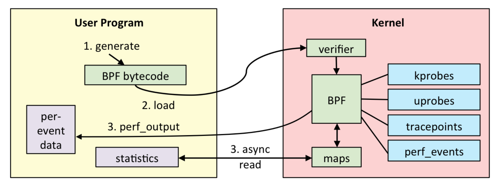
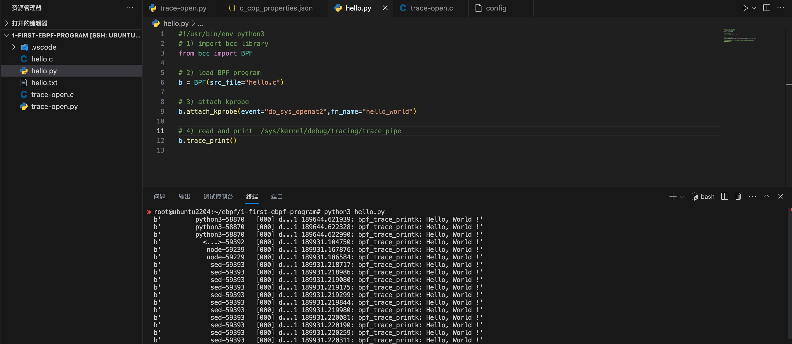

### 	一: 如何搭建eBPF开发环境


准备一台高内核的机器，推荐使用5.x 的内核。以Ubuntu22.04为例

你的机器上执行如下命令:

```
# For Ubuntu20.10+
sudo apt-get update
sudo apt-get install -y  make clang llvm libelf-dev libbpf-dev bpfcc-tools libbpfcc-dev linux-tools-$(uname -r) linux-headers-$(uname -r)
```

其中:

1. llvm: 负责将eBPF程序编译成BPF字节码

2. make : C语言程序编译工具
3. libbpf: 与内核代码仓库实时同步
4. ebpf工具集BCC

...

 


---

### 二: eBPF的开发流程


 

1. 使用C语言开发一个 eBPF程序
2. 借助LLVM 把eBPF程序编译成BPF字节码
3. 通过bpf系统调用，将BPF字节码提交给内核
4. 内核验证并运行BPF字节码，并把相应的状态保存到BPF map中

5. 用户程序通过BPF map 查询BPF字节码的运行状态


---

### 三: 代码实现

1.  使用C 开发一个eBPF程序

   ```c
   int hello_world(void *ctx)
   {
       bpf_trace_printk("Hello, World!");
       return 0;
   }
   ```

   bpf_trace_printk() 是一个最常用的 BPF 辅助函数，它的作用是输出一段字符串。不过，由于 eBPF 运行在内核中，它的输出并不是通常的标准输出（stdout）

   

2. 使用 Python 和 BCC 库开发一个用户态程序

   ```python
   #!/usr/bin/env python3
   # 1) import bcc library
   from bcc import BPF
   
   # 2) load BPF program
   b = BPF(src_file="hello.c")
   # 3) attach kprobe 将bpf程序挂载到内核探针
   b.attach_kprobe(event="do_sys_openat2", fn_name="hello_world")
   # 4) read and print /sys/kernel/debug/tracing/trace_pipe 读取内核调试文件
   b.trace_print()
   ```

   在运行的时候，BCC 会调用 LLVM，把 BPF 源代码编译为字节码，再加载到内核中运行。


3. 执行eBPF程序

   ```bash
   sudo python3 hello.py
   ```

    

   输出结果如上图所示:

   ```bash
   b'         python3-58870   [000] d...1 189644.621939: bpf_trace_printk: Hello, World !'
   ```

   python3-58870 表示进程的名字和 PID；

   [000] 表示cpu的编号

   189644.622328 表示时间戳

   bpf_trace_printk 表示函数名

   Hello, World ! 表示调用bpf_trace_printk 传入的字符串


---


### 四: 备注

BCC 是一个 BPF 编译器集合，包含了用于构建 BPF 程序的编程框架和库，并提供了大量可以直接使用的工具。使用 BCC 的好处是，它把上述的 eBPF 执行过程通过内置框架抽象了起来，并提供了 Python、C++ 等编程语言接口。这样，你就可以直接通过 Python 语言去跟 eBPF 的各种事件和数据进行交互。